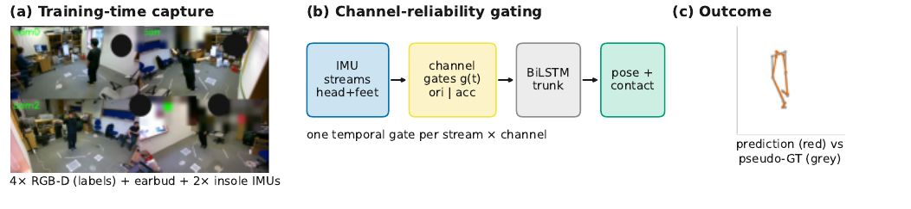

# Reliability-Gated IMU Fusion

*Consumer Head and Foot IMUs for Lower-Body 3D Pose*

[](https://arxiv.org/abs/2609.35764)

**[Zhilin Guo](https://zhilinguo.github.io/)¹, [Boqiao Zhang](https://boqiaoz00.github.io/boqiao_steven_zhang.github.io/)¹, Oszkár Urbán¹, [Josef Bengtson](https://www.chalmers.se/en/persons/bjosef/)², [Hakan Aktas](https://scholar.google.com/citations?user=RxjN5w4AAAAJ&hl=en)¹, [Wenzhao Li](https://wenzhao-cam.github.io/)¹, [Siyu Hong](https://www.linkedin.com/in/siyuhong/)¹, [Kyle Fogarty](https://kyle-fogarty.github.io/)¹, [Chenliang Zhou](https://chenliang-zhou.github.io/)¹, Ali Senguel¹, [Cengiz Oztireli](https://sites.google.com/view/cengiz-oztireli-intro/home)¹**

¹ University of Cambridge &nbsp;&nbsp;·&nbsp;&nbsp; ² Chalmers University of Technology

> Sparse inertial pose estimation promises camera-free motion capture from consumer devices, but consumer sensors are unreliable: firmware-fused orientations are biased, mounting varies between sessions, and streams drift or drop out. On a new 35-take single-subject benchmark pairing an earbud head inertial measurement unit (IMU) with two smart-insole foot IMUs (SAM-3D-Body pseudo-ground-truth labels), we show the reliability problem is channel-level: a channel ablation isolates foot acceleration as the most informative input (66.6 mm vs. 79.0 mm head-only) and the firmware-fused foot orientation as the liability that destroys the gain. We therefore let the model learn how much to trust each channel of each stream: one temporal gate per stream per channel block, trained with an auxiliary reliability objective on synthetically corrupted pretraining data. The channel-gated model is the most accurate of our learned fusion arms on clean data (69.4 mm vs. 83.7 static, 86.6 ungated) and under every simulated fault (bias in training; drift, dropout eval-only); its gates suppress the natively biased foot-orientation channels on clean real data without test-time supervision and flag dropout bursts at 0.92–0.999 AUROC. Two contrasts: dropping a channel known a priori to fail is flat across foot faults but collapses when an unanticipated stream fails (head dropout: 92.9 vs. 79.3 mm); and a fine-tuned HMD-Poser is more accurate on clean data (64.4 mm) and nominally under drift, with no significant paired difference under bias or dropout, but a larger worst-case degradation from clean (+16.1 vs. +3.5 mm, single seed). Learning to gate reliability instead of sensor count is the lever for deployable sparse inertial capture.



**Reliability is a channel-level property: learn how much to trust each channel of each stream.** *(a) Training-time capture: four RGB-D views (labels only), an earbud head IMU, and two smart-insole foot IMUs — no pelvis sensor, no foot gyroscope. (b) Channel-reliability gating: one temporal gate per stream per channel block learns how much, and when, to trust orientation vs. acceleration, supervised only by synthetic corruption in pretraining. (c) Held-out prediction (red) vs. pseudo-GT (grey): foot acceleration alone reaches 66.6 mm (79.0 mm head-only), the channel gate is the most accurate of our learned fusion arms in every fault regime, and the gates flag dropout bursts at 0.92–0.999 AUROC without test-time supervision.*

## Code coming soon

We are preparing the public code release. Watch this repository for updates.

## Citation

If you use this work, please cite:

```bibtex
@article{guo2026reliability,
  title  = {Reliability-Gated Fusion of Consumer Head and Foot IMUs for Lower-Body 3D Pose},
  author = {Guo, Zhilin and Zhang, Boqiao and Urb{\'a}n, Oszk{\'a}r and Bengtson, Josef and Aktas, Hakan and Li, Wenzhao and Hong, Siyu and Fogarty, Kyle and Zhou, Chenliang and Senguel, Ali and Oztireli, Cengiz},
  year   = {2026},
  journal = {arXiv preprint arXiv:2609.35764}
}
```

## License

This project is licensed under the Apache License 2.0, as found in the [LICENSE](LICENSE) file.
